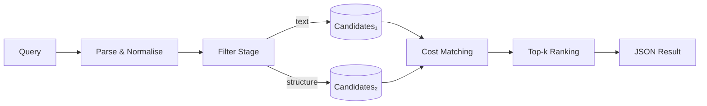

**Moongle Design Document (v0.1)**
*— A MoonBit API & type‑signature search engine inspired by Hoogle*

---

### 1 Vision & Goals

* **Type‑centric search** – developers can locate MoonBit APIs by approximate type signatures, identifiers, or free‑text keywords, just as they do with Hoogle.
* **MoonBit‑aware** – handles `async`, `raise …`, named/optional parameters, `DynTrait`, generics with trait bounds, etc.
* **Fast feedback** – ≤ 0.3 s for local datasets (≤ 10 k functions), ≤ 1 s for cloud‑scale queries.
* **Open interfaces** – uniform JSON schema served by CLI and Web API.

---

### 2 Core Ideas

| Term              | Purpose                                                                                                        |
| ----------------- | -------------------------------------------------------------------------------------------------------------- |
| **Type Expr**     | A full MoonBit type expression (including effects and generic constraints).                                    |
| **Structure Key** | A canonical “skeleton + term list” used for rapid structural matching.                                         |
| **Cost Vector**   | A multi‑dimensional score (≈ 15 features) measuring distance between a query and a candidate; lower is better. |

---

### 3 Query Language (EBNF)

```ebnf
Query          ::= TypeSig | Ident | Keywords
TypeSig        ::= TyParams? Params '->' RetType Raise? Async?
TyParams       ::= '[' TyParam (',' TyParam)* ']'
TyParam        ::= Ident (':' ConstraintList)?
Params         ::= '(' Param (',' Param)* ')'
Param          ::= Ident? ':'? TypeExpr Default? Variadic?
Raise          ::= 'raise' ExceptionList
Async          ::= 'async'
```

*Examples*

* `(K, V) -> Int` – minimal function
* `[T : Compare] (Array<T>, Int) -> Option<T>` - function with generic parameters
* `async (content? : Json, path~ : JsonPath = ..) -> Unit raise JsonDecodeError`

---

### 4 Data Ingestion & Indexing

1. **Parsing** – use `Language.Moonbit.Mbti.Parser` to read every *.mbti* file and emit `(ModulePath, FnSig, Doc)` tuples.
2. **Normalization**

   * **α‑renaming** – canonicalise type variables (`a`, `b`, `c`, …).
   * **Alias expansion** – inline `type`/`using` aliases for indexing; compensate lazily at query time.
   * **Effect lifting** – treat `raise` sets and `async` flags as extra structural dimensions.
3. **Dual‑index strategy**

   * **Trie / FST** for identifiers and doc tokens (fast textual matching).
   * **Structure‑Key → Posting List** for structural matches; \~25 distinct key shapes keep the posting lists sparse.

---

### 5 Search Pipeline



1. **Text filter** – discard obviously unrelated items via the trie (O(log n)).
2. **Structural filter** – compare Structure Keys, allowing a single box/unbox (e.g. `T` ↔ `Option<T>`) or collection alias (`[]` ↔ `List`).
3. **Argument‑level search** – solve each parameter locally, then combine into full signatures while applying composite costs (missing arg, unsatisfied bound, etc.).
4. **Dijkstra / A\*** – run on the local type graph; first answer is near‑instant, full top‑k within 0.5 s for 10 k sigs.

---

### 6 Cost Model (initial weights)

| Feature      | Meaning                              | Cost |
| ------------ | ------------------------------------ | ---- |
| `badArg`     | parameter missing/extraneous         |  +5  |
| `badInst`    | unmet trait constraint               |  +4  |
| `alias`      | hit via type alias                   |  +3  |
| `box/unbox`  | `T` ↔ `Option<T>` or collection wrap |  +2  |
| `dupVar`     | duplicated type variable             |  +2  |
| `restrict`   | losing a constraint                  |  +1  |
| `effectDiff` | differing `raise` set                |  +6  |
| `asyncDiff`  | `async` mismatch                     |  +3  |

Ranks will be refined automatically (learning‑to‑rank over click logs).

---

### 7 System Architecture

* **Core Engine (Haskell)** – pure kernel using `vector` & `unordered‑containers`; exposes `search :: Query -> IO [Result]`.
* **HTTP Service (Rust)** – wraps the kernel via FFI, adds Moka LRU cache and hot‑swapable indexes.
* **Front‑ends**

  * CLI: `moongle "(K, V) -> Int"`.
  * VS Code / Neovim extensions (hover‑to‑search).
  * Web UI : a minimalist search box where users enter a query and, in the results, each item links straight to the corresponding MoonBit API documentation

---

### 8 Performance & Quality Targets

| Metric          | Target                          |
| --------------- | ------------------------------- |
| Index build     | 1 M sigs ≤ 60 s, 2 GB RAM       |
| Query p50       | 50 ms (local) / 120 ms (remote) |
| Query p95       | 120 ms / 300 ms                 |
| Top‑1 precision | ≥ 85 % (beta)                   |
| Top‑5 coverage  | ≥ 97 %                          |

---

### 9 Milestones
- [ ] **M1**: `parser` + `α‑normalisation` + `trie index`
- [ ] **M2**: `Structure Key` + `cost vector` + `local search`
- [ ] **M3**: `ranking‑file learner` + `CLI release`
- [ ] **M4**: `Editor plugin` + `web UI`
<!-- - [ ] **M5**: `community beta` & `weight tuning` -->
---

### 10 Future Work

* **Incremental indexing** – live updates via git hooks or package‑repo events.
* **Language bindings** – start with Haskell ↔ Rust FFI; expose C/C++ later.
* **Code example search** – combine AST snippets with doc‑string embeddings.
* **ML‑ranked results** – LambdaMART fine‑tuning on click data.
* **Sharding** – horizontal scale beyond 10 M signatures.

---

*Moongle adapts key ideas from Neil Mitchell’s “Fast Type Searching” (2008), generalising alpha‑normalisation, structural posting lists, and cost‑vector ranking to MoonBit’s richer surface syntax and effect system.*

